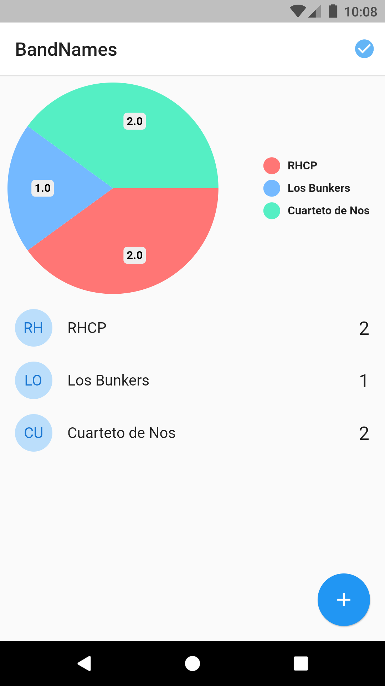

# band_names

BandNames app from Advanced Flutter course

App Features:
* Socket connection
* Dinamic chart
* State management with Provider

This app connects to a [server](https://github.com/mangelsr/band_names_server) via sockets

## Screenshots
### Main screen

